# Sistema de Gestão de Pacientes

Este projeto foi desenvolvido em grupo como parte da disciplina de extensão do curso de Engenharia da Computação da universidade **UniFecaf**.

## 👥 Equipe
- Jhonata Viana Soares
- Luis Gustavo dos Santos Talgatti
- Rickelmy Augusto Souza Pacheco
- Felipe Pardinho Belarmino
- Cláudio José Rodrigues de Oliveira Junior
- Gabriela Camarço de Sousa
- Igor Ferreira Alves

## 🧠 Objetivo
O projeto Aurora foi desenvolvido como parte da disciplina de extensão em Engenharia da Computação. Essa disciplina teve como objetivo o desenvolvimento de uma solução voltada a um ODS (Objetivo de Desenvolvimento Sustentável).

Com esse requisito em mente, nosso grupo escolheu trabalhar com os ODS 3 — Saúde e Bem-Estar — e ODS 9 — Indústria, Inovação e Infraestrutura, tendo como público-alvo uma clínica cuidadora de idosos próxima à nossa cidade.

Ao visitar o local, identificamos grandes dificuldades enfrentadas pelos profissionais da clínica para cadastrar e organizar fichas de pacientes (todos os cadastros eram feitos em fichas de papel), além de desafios na gestão das tarefas diárias.

Diante dessa demanda, nosso grupo projetou um sistema que substitui planilhas e anotações físicas por uma solução digital integrada, promovendo agilidade, organização e segurança no atendimento aos profissionais da clínica.

## 🔧 Tecnologias utilizadas
- **Backend:** Python + Flask  
- **Frontend:** HTML, CSS, JavaScript, Bootstrap  
- **Banco de Dados:** SQLite   
- **Outros:** Git, GitHub

## 📸 Demonstração

**Página inicial de apresentação**  
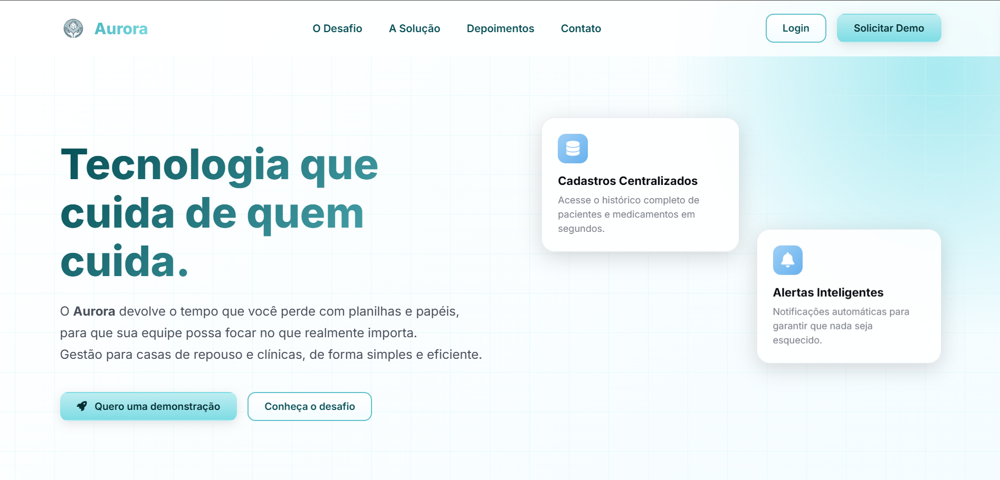  
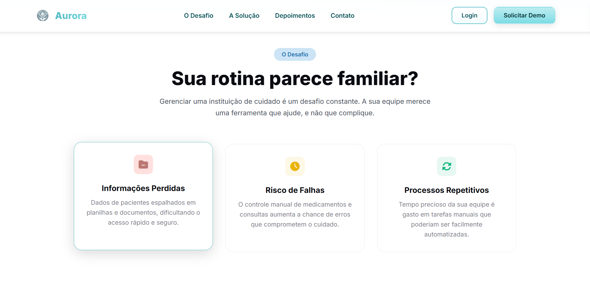  
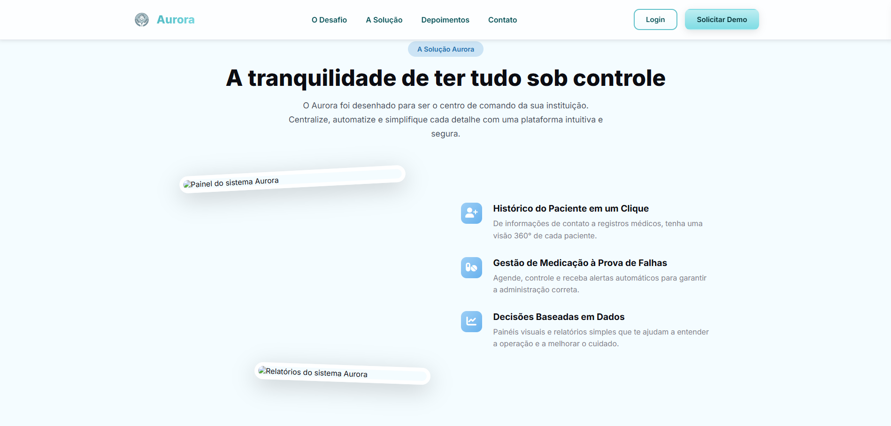  
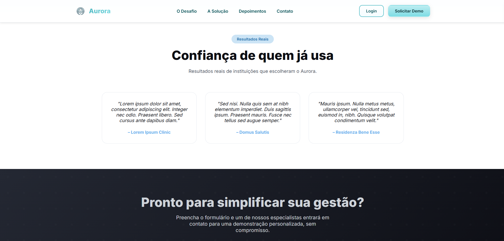  
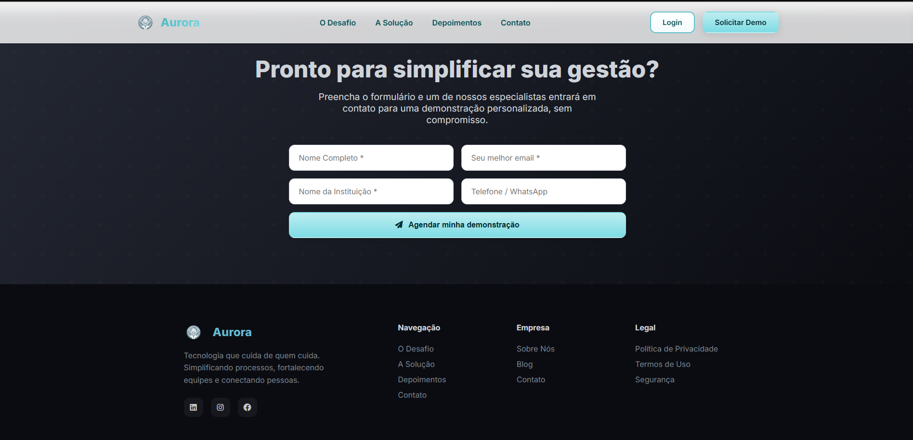

**Login, cadastro e redefinição de senha**  
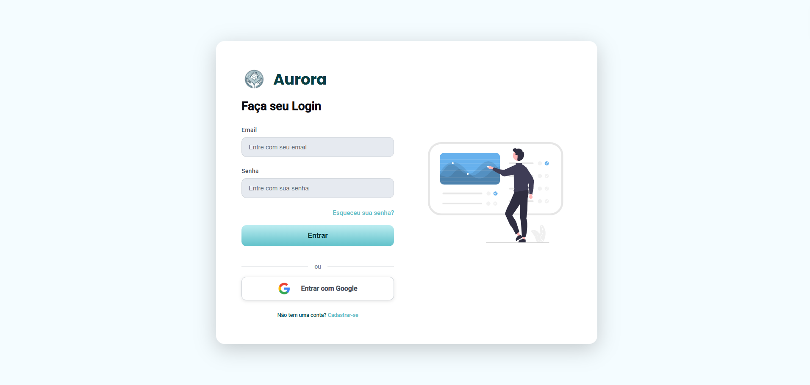  
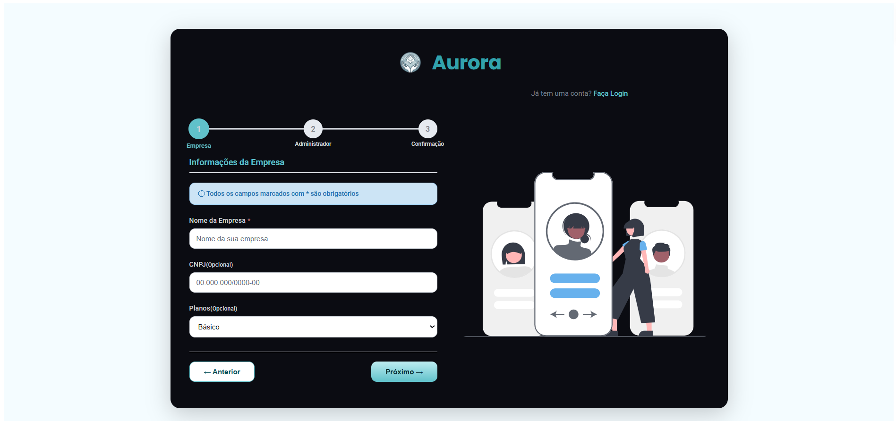  
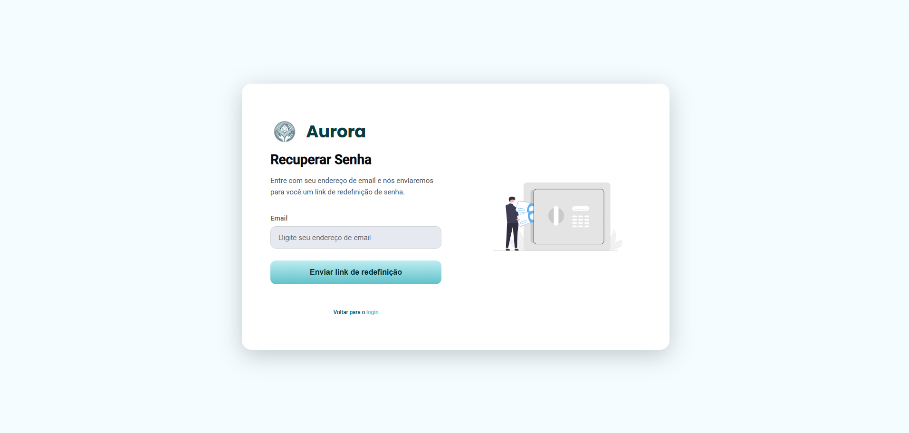

**Tela principal do sistema**  
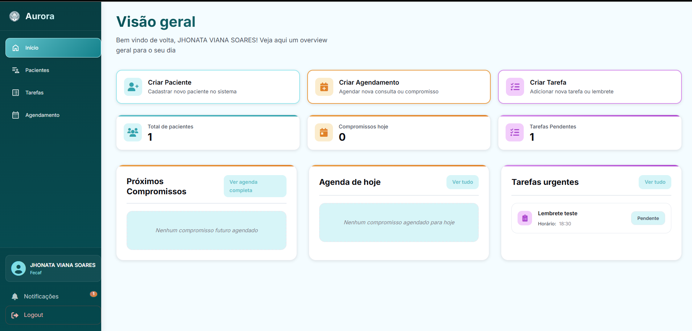

**Gerenciamento de pacientes**  
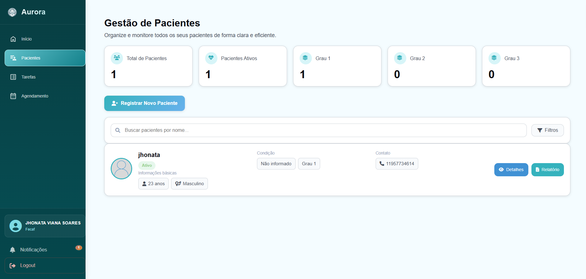  
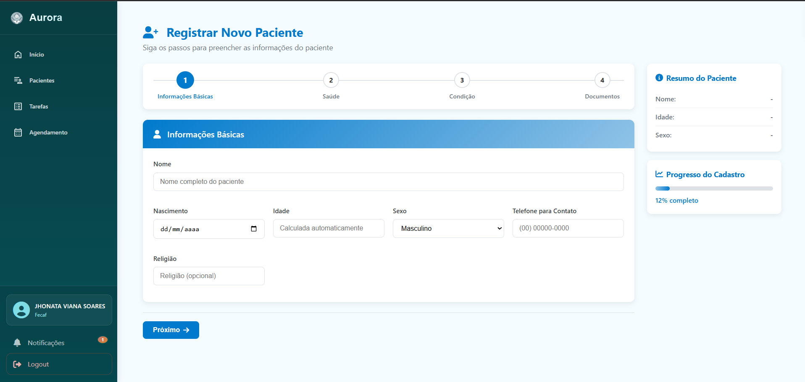

**Administração de tarefas**  
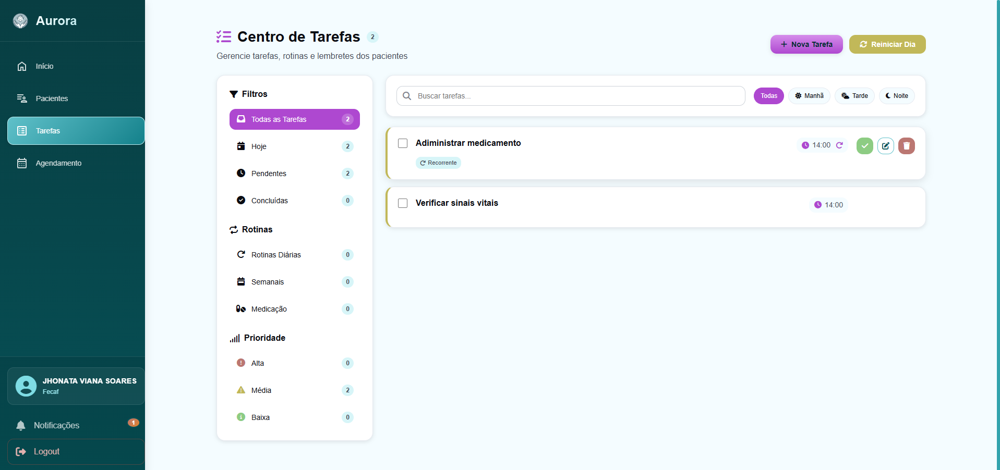  
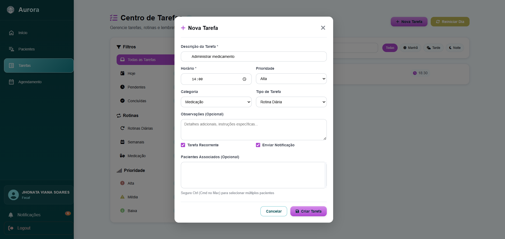

**Agenda**  
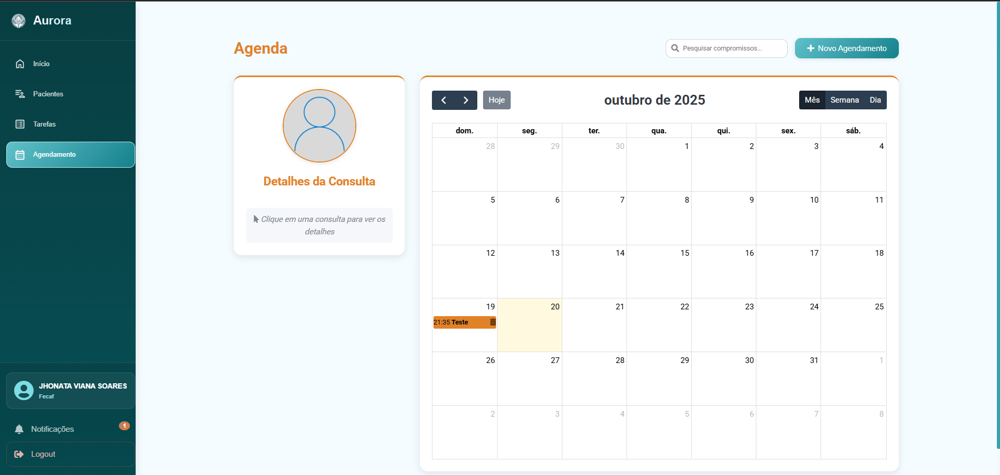

---
## Resumo
```
• Liderou equipe de 7 integrantes no desenvolvimento de sistema web voltado à gestão de pacientes idosos, melhorando organização de tarefas clínicas e administrativas.
• Conduziu pesquisa de campo, levantando requisitos diretamente com cuidadores e profissionais de saúde para identificar gargalos operacionais.
• Prototipou interfaces no Figma e validou fluxos com usuários, reduzindo erros de uso e retrabalho.
• Projetou funcionalidades para lembretes de medicamentos e agendamento de rotinas, mitigando riscos de esquecimento e perdas de informação.
• Aplicou princípios de UX, priorizando clareza visual e agilidade na tomada de decisão da equipe operacional.
```
---

## 🔒 Código-fonte
O código está disponível apenas para os membros do grupo, por questões de privacidade e segurança.

## 🌐 Versão de apresentação
Você pode visualizar uma versão demonstrativa [aqui](https://aurora-v414.onrender.com)
